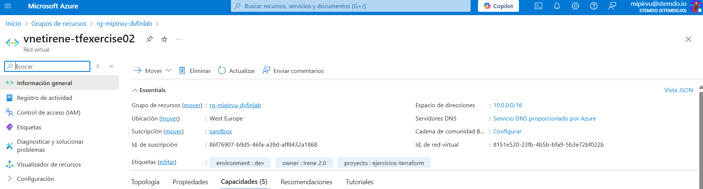

# Ejercicio 03
Este ejercicio consiste en modificar el ejercicio 2 añadiendo tags y teniendo en cuenta ciertas condiciones. 

## Main 
Utilizo **merge ()** para combinar las tags obligatorias y las opcionales. En el caso de haber dos etiquetas con el mismo nombre, las opcionales son las que tienen prioridad. 

```hcl
# Proveedor Azure 
provider "azurerm" {
  features {} # Requerido por el proveedor 
}

# Saca información sobre un resource group
data "azurerm_resource_group" "rg" {
  name = var.existent_resource_group_name # Variable resource group
}

# Creación Virtual Network 
resource "azurerm_virtual_network" "vnet" {
  name                = var.vnet_name 
  location            = var.location
  resource_group_name = data.azurerm_resource_group.rg.name
  address_space       = var.vnet_address_space

# Tags obligatorios (owner y environment) y adicicionales (vnet_tags)
  tags = merge(
    {
    owner = var.owner_tag
    environment = var.environment_tag
    }, 
    var.vnet_tags
  )
}

```

## Variables
Añado las variables con las siguientes características:
* owner_tag -> Obligatoria, tipo string, propietario VNet. 
* environment_tag -> Obligatorio, tipo string, entorno de la VNet.
* vnet_tags -> Opcional (por defecto está vacío), mapa de strings, tags adicionales. En caso de especificar un tag con el mismo nombre, se sobreescribe el valor por el de **vnet_tags**

```hcl
variable "existent_resource_group_name" {
  description = "Nombre del resource group ya existente"
  type        = string
}

variable "vnet_name" {
  description = "Nombre de la Virtual Network"
  type        = string
}

variable "vnet_address_space" {
  description = "Dirección CIDR de la VNet"
  type        = list(string)
}

variable "location" {
  description = "Región de Azure para desplegar la VNet"
  type        = string
  default     = "West Europe"
}

variable "owner_tag" {
  description = "Describe el propietario de la VNet"
  type        = string
}

variable "environment_tag" {
  description = "Describe el entorno de la VNet"
  type        = string
}

variable "vnet_tags" {
  description = "Describe los tags adicionales que se aplicarán a la VNet"
  type        = map(string)
  default     = {}
}

```

## Terraform.tfvars
Declaro los valores que tendrá cada variable. Añado en **vnet_tags** otro valor en owner para probar el correcto funcionamiento del merge.

```hcl
existent_resource_group_name = "rg-mipirvu-dvfinlab"
vnet_name                    = "vnetirene-tfexercise02"
vnet_address_space           = ["10.0.0.0/16"]
owner_tag                    = "Irene"
environment_tag              = "dev"
vnet_tags = {
    proyecto = "ejercicios-terraform"
    owner = "Irene 2.0" # Sobreescribe el owner_tag
}
```

## Terraform plan 


## Terraform apply 




## Terraform destroy 

