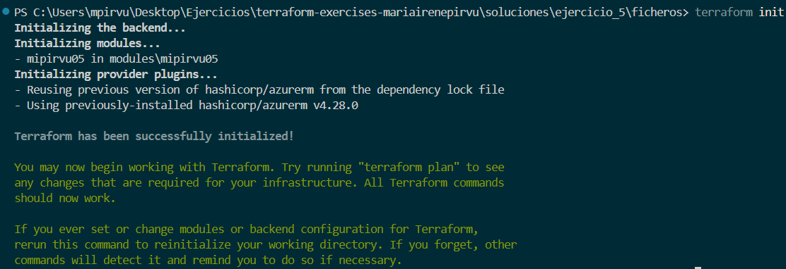
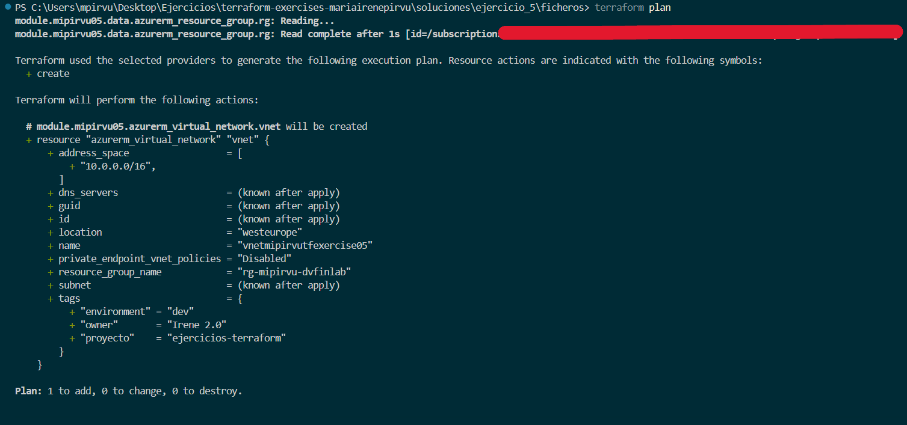
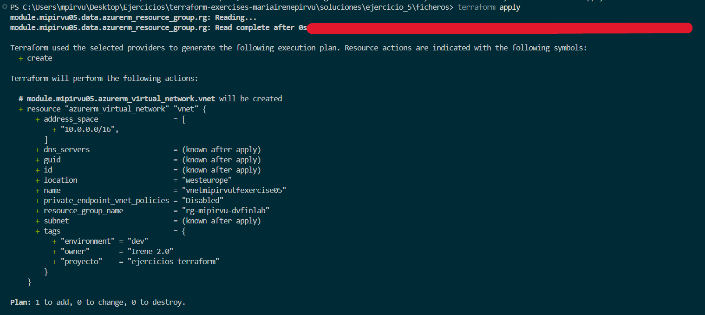
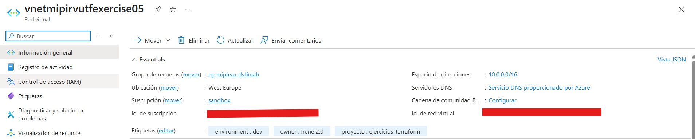
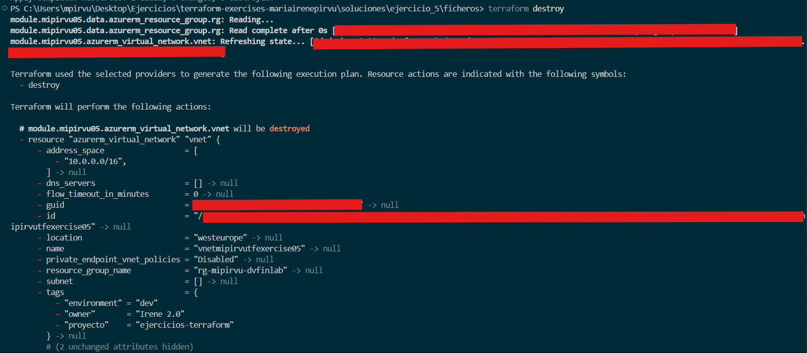

# Ejercicio 05
Reutilizo y adapto los ficheros del ejercicio 4 para crear un módulo. En este ejercicio la estructura del directorio cambia; dentro de **ficheros** nos econtramos con los 3 ficheros del ejercicio anterior pero modificados, en el interior de **modules > mipirvu05** encontramos con esos 3 ficheros tal cual el ejercicio 4 y además el fichero outputs.tf. 


## Main
A la hora de crear módulos reutilizables el main se encarga de llamar y utilizar el módulo creado en **modules > mipirvu05**. La estructura es diferente a los main vistos anteriormente (main de módulo raiz).

```hcl
module "mipirvu05" {
  source                        = "./modules/mipirvu05"
  existent_resource_group_name = var.existent_resource_group_name
  vnet_name                    = var.vnet_name
  vnet_address_space           = var.vnet_address_space
  location                     = var.location
  owner_tag                    = var.owner_tag
  environment_tag              = var.environment_tag
  vnet_tags                    = var.vnet_tags
}

```

## Variables 
En este caso las variables se encargan de referenciar lo que se espera recibir de las variables del módulo raíz. 

```hcl
variable "existent_resource_group_name" {
  type = string
}

variable "vnet_name" {
  type = string
}

variable "vnet_address_space" {
  type = list(string)
}

variable "location" {
  type = string
}

variable "owner_tag" {
  type = string
}

variable "environment_tag" {
  type = string
}

variable "vnet_tags" {
  type = map(string)
}


```
## Outputs
Muestra la información sobre los recursos creados por Terraform, en la descripción conocemos con detalle la información que muestra. 

```hcl
output "vnet_id" {
  description = "ID de la Virtual Network"
  value       = azurerm_virtual_network.vnet.id
}

output "vnet_name" {
  description = "Nombre de la Virtual Network"
  value       = azurerm_virtual_network.vnet.name
}


```
## Terraform init
Con los módulos reutilizables debemos hacer primero un terraform init para que se detecte e inicialice el módulo. 


## Terraform plan




## Terraform apply 




## Terraform destroy 

